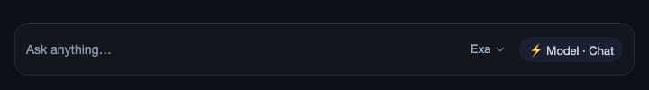
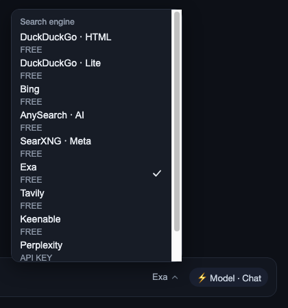

# dsh-search-switcher

[](https://github.com/topics/dsh-plugin)

A compact web-search-engine switcher for the DeepSeek Harness composer. It renders immediately to the **left of the model picker** and changes the preferred engine without opening Settings or typing a slash command.

中文：在 DeepSeek Harness 输入栏的模型切换器左侧提供搜索引擎热切换下拉菜单，无需打开设置或输入命令。

## Features

- Composer control next to the model picker via `conversation.input.right`.
- Scrollable engine list with the current engine marked.
- Reads and writes the `free-search.provider` setting through the loopback bridge.
- Supports the ten engines exposed by `dsh-free-search`:
  - DuckDuckGo HTML
  - DuckDuckGo Lite
  - Bing
  - AnySearch AI
  - SearXNG
  - Exa
  - Tavily
  - Keenable
  - Perplexity
  - DeepSeek Official
- Uses the Harness theme variables.
- Full keyboard support: Arrow keys open the menu from the trigger and move between engines, Home/End jump to the first/last entry, Enter/Space activate, Escape dismisses and returns focus to the trigger.

## Requirements

- DeepSeek Harness Web profile with Node.js 20 or newer.
- [`dsh-free-search`](https://github.com/DDDMUC/dsh-free-search) `>=0.4.7`, which owns the settings bridge and the search provider.

The switcher only changes the preferred provider. It does not bypass provider authentication, API-key requirements, or network restrictions.

### Compatibility with `dsh-free-search` 0.4.22

`dsh-free-search` 0.4.22 registers its settings namespace through the `SettingsProvider.installSection()` method, which only exists in `@deepseek-ai/dsh-settings >= 0.1.2-alpha.2`. On older harness runtimes (DSH Desktop 0.7.1 bundles `0.1.2-alpha.1`; any `dsh` before alpha.2) that registration throws and is contained by Cordis, so the `free-search` namespace is never exposed: the settings bridge answers `/describe` with an empty `namespaces` list and `/mutate` with `settings-not-exposed`. The switcher then cannot read or write the provider — since v0.3.0 the menu shows that exact diagnosis instead of a generic "switch failed".

| `dsh-free-search` | Harness `dsh-settings <= 0.1.2-alpha.1` | Harness `dsh-settings >= 0.1.2-alpha.2` |
| --- | --- | --- |
| `<= 0.4.21` | ✅ works | ❌ fails to load (`installSettingsSection` removed) |
| `0.4.22` | ❌ settings-not-exposed | ✅ works |

Fix options:

1. **Upgrade DSH Desktop / the harness runtime** to a build bundling `@deepseek-ai/dsh-settings >= 0.1.2-alpha.2` (preferred — `dsh-free-search` 0.4.22 works there as-is).
2. On the old runtime, **patch the installed `dsh-free-search` 0.4.22** locally: replace its `sctx.settings.installSection(...)` block with the exported `installSettingsSection(ctx, ...)` helper (identical semantics, present in the old runtime). The exact two-line diff is in the bug report on [DDDMUC/dsh-free-search](https://github.com/DDDMUC/dsh-free-search/issues) — please report it there so upstream ships a version compatible with both runtimes.
3. Or pin `dsh-free-search` at `0.4.21` or older while staying on the old runtime.

### Blocked-network use case

Overseas university and campus networks often block `api.deepseek.com`, which makes the DeepSeek Official provider unavailable while the rest of the harness keeps working. This switcher exists so you can fall back to Bing, DuckDuckGo, SearXNG, or another reachable provider in one click — no Settings page, no provider editing by hand.

## Screenshots

The trigger beside the model picker, and the open engine menu:





## Install

Using the Harness plugin CLI:

```bash
dsh plugin --profile web add https://github.com/Hudson-Junior-Wang/dsh-search-switcher.git
```

If your CLI uses the profile as the current default, this is equivalent:

```bash
dsh plugin add https://github.com/Hudson-Junior-Wang/dsh-search-switcher.git
```

Install `dsh-free-search` as well if it is not already present:

```bash
dsh plugin --profile web add https://github.com/DDDMUC/dsh-free-search.git
```

Then restart the Harness host or reload the Web UI. The new control appears immediately left of the model selector in an active conversation.

### Manual profile installation

Add the package to the profile dependencies and add `dsh-search-switcher` to `dsh.profile.bundles`. The package's `cordis.patch.yml` loads its entry automatically.

If the profile already contains a manually inserted `dsh-search-switcher` entry, remove that manual patch before using `dsh plugin add`; otherwise the same loader entry can be registered twice.

## Development

```bash
npm test          # bundle smoke test (manifest, patch, syntax)
npm run check     # node --check on both lib files
```

The client bundle is intentionally a self-contained ModuleLoader bundle so it can be served by the Harness client-module system without a separate build step.

## License

[MIT](./LICENSE)
